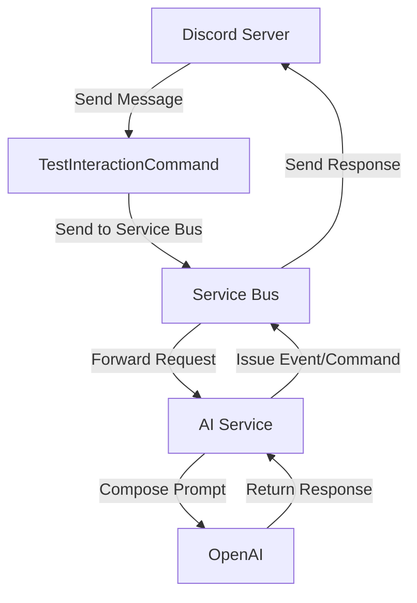

# Task

- From server to AI/OpenAI
- From AI/OpenAI to server

I wanna be able to compose a request to open ai that sends the message from the discord server along with the appropriate prompt to make the AI act like a game master

## Steps

1. Create a new command for TestInteractionCommand to issue to the service bus
1. Get a service bus up and running
1. Create a command handler for the new command
1. Command handler should forward the request to the AI service
1. AI service composes the prompt and sends it to OpenAI
1. OpenAI returns a response
1. AI service either issues and event or another command to the service bus
1. Command handler for the event or command should send the response back to the correct discord server

